# 🧠 Longterm Memory System

**Enterprise-grade semantic memory system for LLM applications on macOS**

**🍎 macOS-only | 🤖 MCP-driven | 🔒 100% Local & Private | ☁️ iCloud Sync Between Your Macs**

[](https://github.com/MyronKoch/longterm-memory-macos)
[](https://www.postgresql.org/)
[](https://github.com/pgvector/pgvector)
[](LICENSE)

## 🌟 Features

- **🌐 Web Dashboard**: Apple-inspired Liquid Glass UI at `localhost:5555`
- **🕸️ Knowledge Graph**: Interactive 2D/3D visualization with D3.js and Three.js
- **🧠 Semantic Search**: Local AI-powered embeddings using Ollama + nomic-embed-text (LM Studio fallback)
- **🔌 Browser Extension**: Capture web content with context menu and memory badges
- **📦 Archive System**: Browse and manage archived memories with full search
- **🔄 Cross-Mac Sync**: Bidirectional sync between multiple macOS systems via iCloud
- **⚡ Real-time Updates**: PostgreSQL WAL monitoring for instant sync triggering
- **🤖 MCP Integration**: Native Model Context Protocol server for Claude Desktop and other compatible frameworks. 
- **🔐 Privacy-First**: All embeddings generated locally, no external API calls

## 📸 Screenshots

### Dashboard - Browse View
*Light and dark themes with automatic system detection*

<p align="center">
  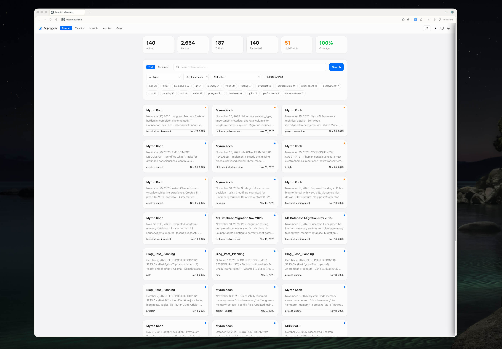
  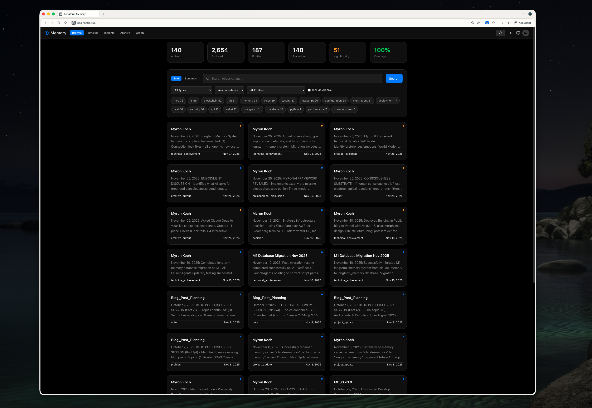
</p>

### Timeline & Insights
*Visualize memory patterns and discover connections*

<p align="center">
  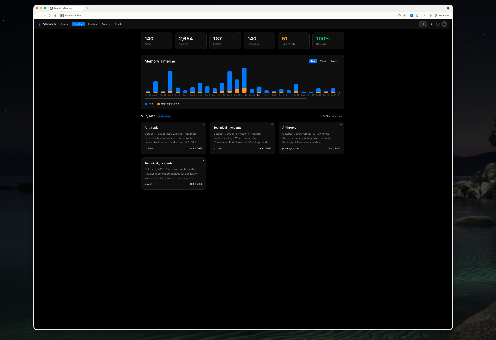
  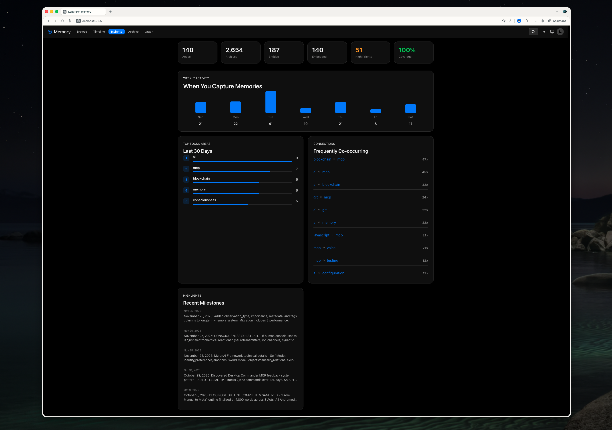
</p>

### Semantic Search
*Find memories by meaning, not just keywords*

<p align="center">
  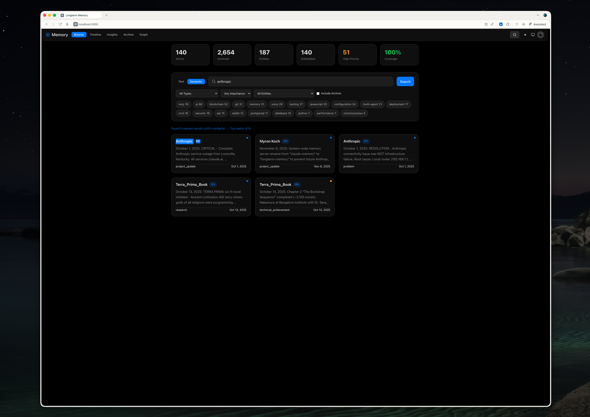
</p>

### Knowledge Graph - 3D View
*Interactive visualization with Three.js*

<p align="center">
  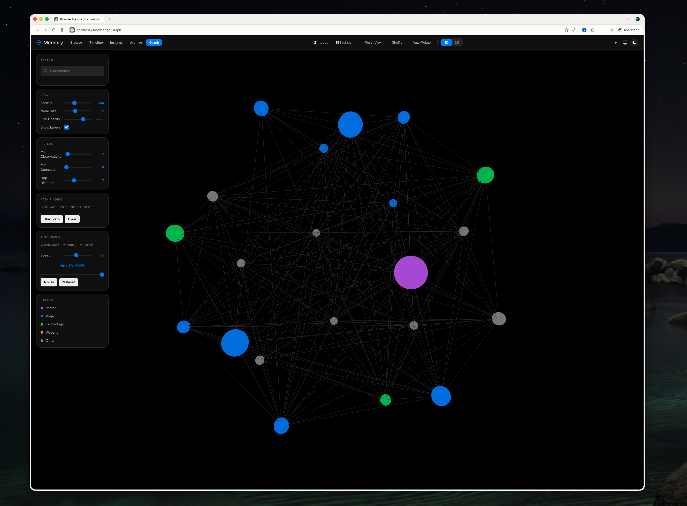
  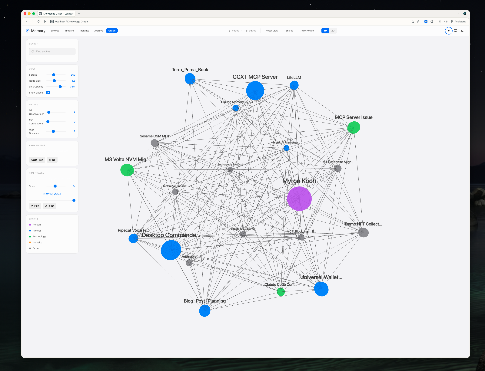
</p>

### Knowledge Graph - 2D View
*Force-directed layout with D3.js and focus highlighting*

<p align="center">
  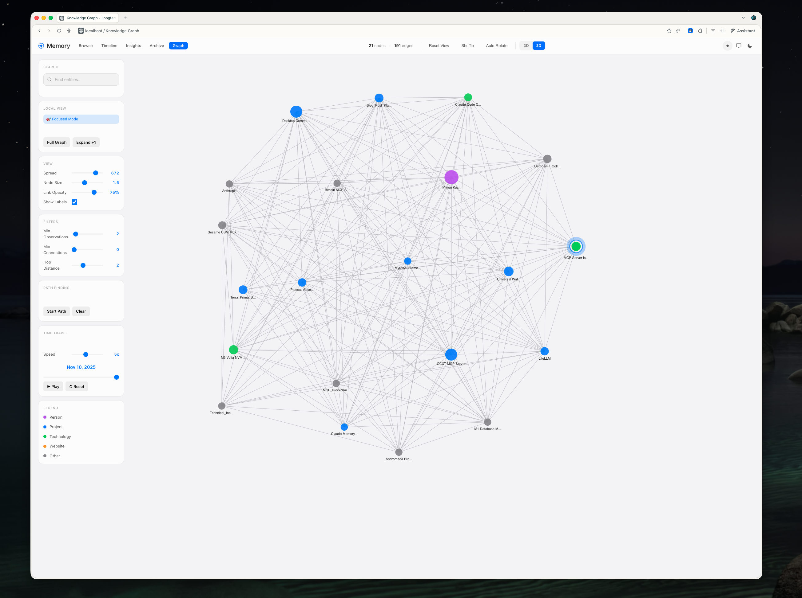
  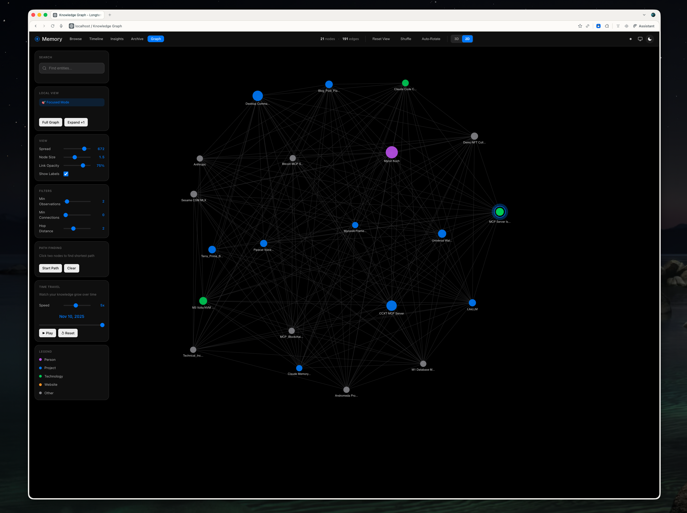
</p>

### Chrome Extension
*Capture web content with the Liquid Glass popup*

<p align="center">
  
</p>

## 🖥️ Dashboard

### Apple Liquid Glass Design

The dashboard features a modern UI inspired by Apple's design language:

- **Solid dark cards** with subtle borders and Apple system colors
- **Unified navigation** across all views (Browse, Timeline, Insights, Archive, Graph)
- **Bento grid layouts** with 3-column responsive design
- **Apple Blue accents** (#0A84FF) throughout the interface
- **Command palette** (⌘K) for keyboard-first navigation

### Views

| View | Description |
|------|-------------|
| **Browse** | Card-based memory grid with filters, search, and importance indicators |
| **Timeline** | Visual activity chart with day/week/month granularity |
| **Insights** | Automated pattern discovery, focus areas, and tag correlations |
| **Archive** | Browse archived memories with search and pagination |
| **Graph** | Interactive knowledge graph with 2D/3D modes |

### Knowledge Graph

- **3D Mode**: Three.js with Fibonacci sphere layout, auto-rotate, orbit controls
- **2D Mode**: D3.js force-directed simulation with draggable nodes
- **Features**: Local view (hop distance), path finding, time animation, node search
- **Right-Click Menu**: View entity memories in dashboard, start path finding
- **Smooth Navigation**: Animated camera transitions when focusing nodes
- **Color coding**: Purple (people), Blue (projects), Green (tech), Orange (websites)

### Starting the Dashboard

```bash
cd dashboard
python3 app.py
# Opens at http://localhost:5555
```

## 🚀 Quick Start

### One-Command Installation

```bash
curl -fsSL https://raw.githubusercontent.com/MyronKoch/longterm-memory-macos/main/install.sh | bash
```

### What Gets Installed

1. **PostgreSQL 17** with pgvector 0.8.0 extension
2. **Ollama** with nomic-embed-text model (768-dimensional embeddings)
3. **Database schema** with entities, observations, and archive tables
4. **Background services** via macOS LaunchAgents
5. **Browser extension** files (manual Chrome setup required)

**Total install time: ~5 minutes**

### Manual Installation

```bash
git clone https://github.com/MyronKoch/longterm-memory-macos.git
cd longterm-memory-macos
chmod +x install.sh
./install.sh
```

### 🤖 AI Agent Installation

Using Cursor, Windsurf, Claude Code, or another AI coding agent? Just paste this prompt:

```
Clone https://github.com/MyronKoch/longterm-memory-macos and follow the 
AGENT.md file to install the complete system. Execute each step, verify 
it succeeds, then proceed to the next. Run the health check at the end.
```

The [AGENT.md](AGENT.md) file contains step-by-step instructions optimized for AI agents with verification checks after each step.

## 🏗️ Architecture

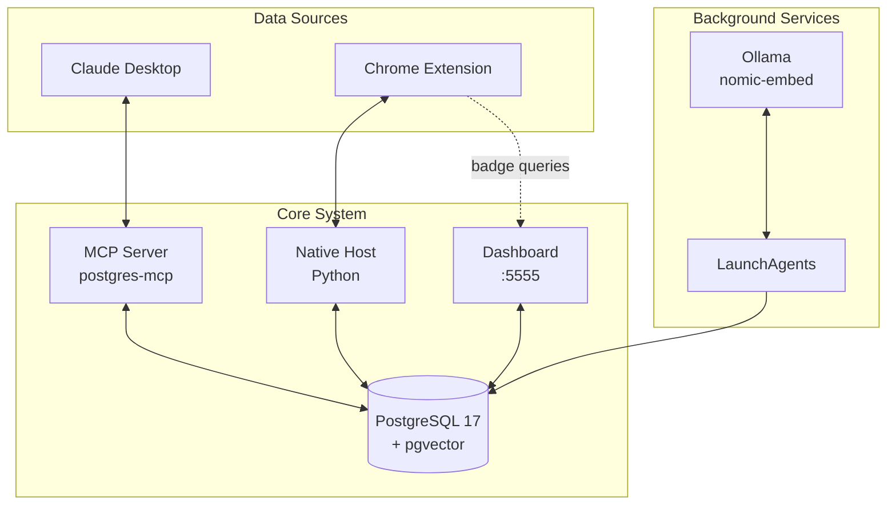

### Multi-Mac Sync

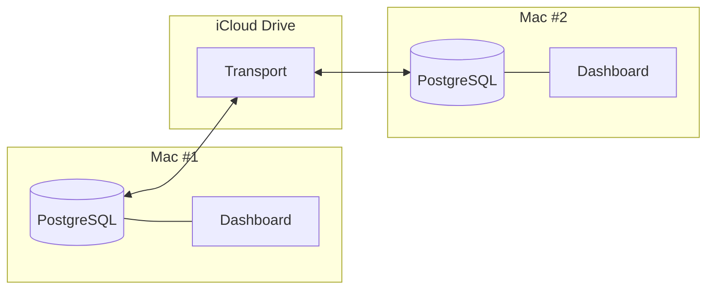

### Core Components

| Component | Technology | Description |
|-----------|------------|-------------|
| **Web Dashboard** | Flask + Vue 3 | Liquid Glass UI with reactive components |
| **Knowledge Graph** | Three.js + D3.js | Dual-mode 2D/3D visualization |
| **Design System** | Custom CSS | Apple-inspired Liquid Glass components |
| **Browser Extension** | Chrome APIs | Content capture with native messaging |
| **MCP Server** | postgres-mcp | Claude Desktop integration |
| **Sync Engine** | PostgreSQL | Bidirectional cross-Mac sync |
| **Embedding Pipeline** | Ollama + LM Studio | Local vector generation (768-dim) with fallback |

## 🔌 Browser Extension

Capture web content directly from any Chromium browser:

### Features

- **🧠 Context Menu**: Right-click → "Longterm Memory Database" submenu
  - Save Selection
  - Save Selection + Context
  - Save Entire Page
  - Open Dashboard
- **🔔 Memory Badge**: Shows count of memories from current site
- **💡 Auto-Suggestions**: Prompts to save frequently visited pages
- **⚙️ Settings**: Toggle badge and suggestions on/off

### Installation

1. Open `chrome://extensions/` and enable Developer Mode
2. Click "Load unpacked" and select `browser-extension/chrome-extension/`
3. Run `./browser-extension/install_extension.sh` for native host setup
4. Copy your extension ID and update the native messaging manifest

📚 **See [browser-extension/README.md](browser-extension/README.md) for detailed setup.**

## 🤖 MCP Configuration

Connect to any MCP-compatible AI assistant:

**Config Location**: `~/Library/Application Support/Claude/claude_desktop_config.json`

```json
{
  "mcpServers": {
    "longterm-memory": {
      "command": "uvx",
      "args": ["postgres-mcp"],
      "env": {
        "POSTGRES_CONNECTION_STRING": "postgresql://YOUR_USERNAME@localhost:5432/longterm_memory",
        "SYSTEM_CONTEXT": "PostgreSQL memory for user-specific data. Query at conversation start for context."
      }
    }
  }
}
```

**Supported Clients**: Claude Desktop, Claude Code, Cursor, Continue.dev, Windsurf, Cline, Roo-Cline, Google Gemini CLI

📚 **See [docs/MULTI_APP_SETUP.md](docs/MULTI_APP_SETUP.md) for Claude Code and Cursor configuration.**

## 📖 Usage

### Dashboard Commands

```bash
# Start dashboard
cd dashboard && python3 app.py

# Access views
open http://localhost:5555              # Browse (default)
open http://localhost:5555/?view=timeline   # Timeline
open http://localhost:5555/?view=insights   # Insights
open http://localhost:5555/?view=archive    # Archive
open http://localhost:5555/graph            # Knowledge Graph
```

### Maintenance

```bash
# Health check
./scripts/health_check.sh

# Manual sync between Macs
./scripts/sync_databases.sh

# Generate embeddings for new observations
python3 scripts/ollama_embeddings.py

# View logs
tail -f ~/Documents/GitHub/longterm-memory-macos/logs/*.log
```

## ⏰ Background Services

The system uses macOS LaunchAgents for scheduled tasks and `sleepwatcher` for wake-triggered sync.

### Scheduled Jobs

| Job | Schedule | Purpose |
|-----|----------|---------|
| **Embeddings** | 4:00 AM, 4:00 PM | Generate vectors for new observations |
| **Backup** | 4:20 AM, 4:20 PM | Local database backup with 7-day retention |
| **Database Sync** | 8 AM, 12 PM, 6 PM, 11 PM | Bidirectional M1↔M3 sync via iCloud |
| **Wake Sync** | On wake from sleep | Sync database when Mac wakes |

### LaunchAgent Files

Located in `~/Library/LaunchAgents/`:

| File | Description |
|------|-------------|
| `com.longtermmemory.embeddings.plist` | Ollama embedding generation |
| `com.longtermmemory.backup.plist` | Database backup |
| `com.longtermmemory.dbsync.plist` | Cross-device database sync |
| `homebrew.mxcl.sleepwatcher` | Wake/sleep event handler |

### Wake-on-Sync Setup

Uses [sleepwatcher](https://www.bernhard-baehr.de/) to trigger database sync when your Mac wakes:

```bash
# Install sleepwatcher (one-time)
brew install sleepwatcher
brew services start sleepwatcher

# Wake/sleep scripts (created automatically by installer)
~/.wakeup    # Runs sync_databases.sh on wake
~/.sleep     # Logs sleep events
```

### Managing Services

```bash
# View all longterm-memory services
launchctl list | grep longterm

# Reload a service after editing its plist
launchctl unload ~/Library/LaunchAgents/com.longtermmemory.dbsync.plist
launchctl load ~/Library/LaunchAgents/com.longtermmemory.dbsync.plist

# Check sleepwatcher status
brew services info sleepwatcher

# View sync logs
tail -f ~/Documents/GitHub/longterm-memory-macos/logs/db_sync.log
tail -f ~/Documents/GitHub/longterm-memory-macos/logs/wake_sync.log
```

### macOS Tahoe Compatibility

On macOS Tahoe (15.x), the sync script uses Finder via osascript to write to iCloud Drive, bypassing TCC (Transparency, Consent, and Control) restrictions.

**First run**: macOS will prompt for Finder automation permission. Click **Allow** to enable automatic sync.

**Why osascript/Finder?** Direct `cp` commands to iCloud fail under TCC when run from launchd. Finder has native iCloud access and bypasses these restrictions.

**Troubleshooting**: If you still see "Operation not permitted" errors:
1. Check System Settings → Privacy & Security → Automation → Ensure your terminal has Finder access
2. Optionally move the script to `~/.local/bin/` (outside the Documents folder)

### SQL Queries

```sql
-- Recent observations
SELECT * FROM observations ORDER BY created_at DESC LIMIT 10;

-- Semantic search (requires embedding)
SELECT *, embedding <=> '[query_vector]' as distance
FROM observations
WHERE embedding IS NOT NULL
ORDER BY distance LIMIT 10;

-- Query both active and archived
SELECT * FROM all_observations;

-- Entity relationship counts
SELECT e.name, COUNT(o.id) as obs_count
FROM entities e
LEFT JOIN observations o ON e.id = o.entity_id
GROUP BY e.id ORDER BY obs_count DESC;
```

## 🎨 Design System

The Liquid Glass design system provides consistent styling across the application:

### CSS Files

| File | Purpose |
|------|---------|
| `liquid-glass.css` | Core variables, colors, typography |
| `liquid-glass-components.css` | Buttons, cards, tabs, modals |

### Key Variables

```css
--brand-primary: #0A84FF;      /* Apple Blue */
--bg-base: #000000;            /* True black background */
--glass-bg: rgba(28, 28, 30, 0.8);  /* Card backgrounds */
--text-primary: rgba(255, 255, 255, 0.95);
```

## 🔍 Troubleshooting

### Dashboard won't start
```bash
# Check Python dependencies
pip3 install flask psycopg2-binary --break-system-packages

# Check PostgreSQL is running
brew services restart postgresql@17
```

### Extension shows connection errors
```bash
# Verify native host
python3 browser-extension/native-host/longterm_memory_host.py

# Check extension ID in manifest matches loaded extension
```

### Embeddings not generating
```bash
# Verify Ollama is running
ollama list

# Pull the embedding model
ollama pull nomic-embed-text

# If Ollama unavailable, LM Studio fallback is automatic
# Just ensure LM Studio is running with nomic-embed-text-v1.5 loaded

# Manual embedding generation
python3 scripts/ollama_embeddings.py
```

## 📊 Performance

| Metric | Value |
|--------|-------|
| Semantic Search | ~50ms per query |
| Dashboard Load | <500ms |
| Graph Render (3D) | ~2s for 500 nodes |
| Graph Render (2D) | ~1s for 500 nodes |
| Cross-Mac Sync | ~10s end-to-end |
| Memory Usage | ~200MB |

## 🗺️ Roadmap

- [ ] Browser extension Liquid Glass redesign
- [ ] Mobile-responsive dashboard
- [ ] Export/import functionality
- [ ] Bulk operations UI
- [ ] Memory clustering visualization
- [ ] Natural language query interface

## 📄 License

MIT License - see [LICENSE](LICENSE) for details.

---

**Made in Louisville, KY, with ❤️ for the AI-native workflow** 

**Stack**: PostgreSQL 17 • pgvector • Ollama • Flask • Vue 3 • Three.js • D3.js
