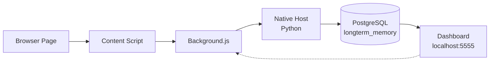

# Longterm Memory Browser Extension v2.0

Chrome/Chromium extension for capturing web content directly to your local longterm memory PostgreSQL database.


## ✨ What's New in v2.0

- **🧠 Branded Context Menu**: Clear "Longterm Memory Database" parent menu
- **📝 Multiple Save Options**: Selection, Selection+Context, or Entire Page
- **🔔 Memory Badge**: See how many memories you have from the current site
- **💡 Auto-Suggestions**: Prompted to save pages you visit frequently
- **⚙️ Settings Panel**: Toggle features on/off in the popup
- **🍞 Toast Notifications**: In-page confirmations instead of Chrome alerts

## Features

### Context Menu (Right-Click)
When you right-click on any webpage, you'll see:

```
🧠 Longterm Memory Database  →  Save Selection
                                 Save Selection + Context
                                 Save Entire Page
                                 ─────────────────
                                 Open Dashboard
```

- **Save Selection**: Quick save of highlighted text
- **Save Selection + Context**: Includes the surrounding paragraph for better context
- **Save Entire Page**: Captures full page content
- **Open Dashboard**: Opens `localhost:5555` to browse your memories

### Memory Badge
- Floating purple badge appears when you have memories from the current domain
- Shows the count of saved memories
- Click to see a panel with all your memories from that site
- "View all in Dashboard" links directly to filtered search

### Auto-Suggestions
- Tracks how often you visit pages (locally, never sent anywhere)
- After 10 visits, suggests saving the page
- "Don't ask again" dismisses for that domain
- Configurable in settings

### Extension Popup
- Quick note capture with page context
- Category selection (auto-detected or manual)
- Importance slider
- Quick-tag buttons
- Full page capture button

### Settings (in Popup)
- **Show memory badge on pages**: Toggle the floating badge
- **Auto-suggest frequent pages**: Toggle visit-based suggestions

## Prerequisites

1. **Longterm Memory System** installed and running:
   - PostgreSQL 17 with `longterm_memory` database
   - Ollama with `nomic-embed-text` model
   - See main [README](../README.md) for installation

2. **Dashboard running** (for memory badge and bi-directional sync):
   ```bash
   cd dashboard && python3 app.py
   ```

3. **Python 3** with psycopg2:
   ```bash
   pip3 install psycopg2-binary --break-system-packages
   ```

## Installation

### 1. Run Installation Script

```bash
cd browser-extension
./install_extension.sh
```

### 2. Load Extension in Chrome

1. Open `chrome://extensions/`
2. Enable **Developer mode** (toggle in top right)
3. Click **Load unpacked**
4. Select: `browser-extension/chrome-extension/`

### 3. Configure Native Messaging

1. Copy your **Extension ID** from `chrome://extensions/`
2. Update the native host manifest:
   ```bash
   nano ~/Library/Application\ Support/Google/Chrome/NativeMessagingHosts/com.longtermmemory.host.json
   ```
3. Replace `EXTENSION_ID_PLACEHOLDER` with your actual extension ID
4. **Restart Chrome** completely

## Supported Browsers

Works in **all Chromium-based browsers**:

- ✅ Google Chrome
- ✅ Microsoft Edge
- ✅ Brave
- ✅ Arc
- ✅ Perplexity Comet
- ✅ Any Chromium browser

For other browsers, copy the native messaging manifest to their respective directories.

## Architecture



## Data Flow

### Saving Content
1. User triggers save (context menu, popup, or auto-suggestion)
2. Content script extracts page content/selection
3. Background script packages with metadata
4. Native host inserts into PostgreSQL
5. Toast notification confirms save
6. Ollama generates embedding (via cron job)

### Memory Badge
1. On page load, background script queries dashboard API
2. API returns memories matching current domain
3. Badge count displayed in toolbar icon
4. Floating badge appears on page (if enabled)
5. Click reveals panel with memory previews

## Configuration Files

### Native Host Manifest
`~/Library/Application Support/Google/Chrome/NativeMessagingHosts/com.longtermmemory.host.json`

```json
{
  "name": "com.longtermmemory.host",
  "description": "Longterm Memory native messaging host",
  "path": "/path/to/longterm_memory_host.py",
  "type": "stdio",
  "allowed_origins": ["chrome-extension://YOUR_EXTENSION_ID/"]
}
```

### Extension Storage
Settings are stored in `chrome.storage.local`:
- `showMemoryBadge`: boolean (default: true)
- `showAutoSuggestions`: boolean (default: true)
- `pageVisits`: object tracking visit counts
- `dismissedDomains`: array of domains to skip suggestions

## Troubleshooting

### "Native host disconnected" error
```bash
# Verify Python and dependencies
python3 -c "import psycopg2; print('✅ OK')"

# Test native host directly
echo '{"action":"test"}' | python3 native-host/longterm_memory_host.py
```

### Memory badge not appearing
1. Ensure dashboard is running: `http://localhost:5555`
2. Check setting is enabled in popup
3. Verify you have memories from that domain

### Context menu not showing
1. Reload extension in `chrome://extensions/`
2. Restart Chrome completely
3. Check console for errors

## Privacy & Security

- **100% Local**: All data stored in your PostgreSQL database
- **No Cloud**: Never sends data to external servers
- **No Tracking**: Visit counts stored locally only
- **Open Source**: Inspect all code in this repository

## Uninstall

1. Remove extension from `chrome://extensions/`
2. Remove native messaging host:
   ```bash
   rm ~/Library/Application\ Support/Google/Chrome/NativeMessagingHosts/com.longtermmemory.host.json
   ```

## License

MIT License - see [LICENSE](../LICENSE)
