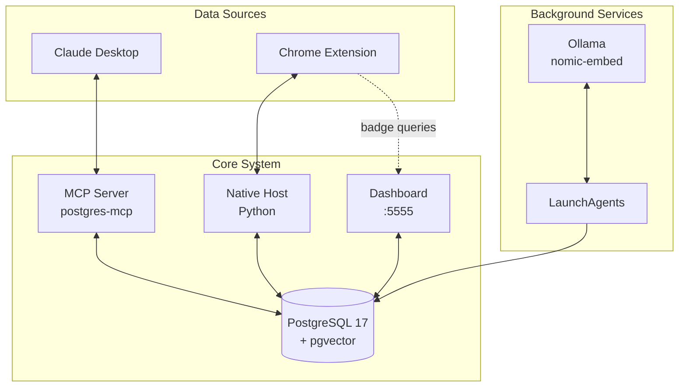

# Architecture & Usage Guide

## 🏗️ System Architecture



### Core Components

| Component | Description |
|-----------|-------------|
| **Claude Desktop** | AI conversations with MCP integration |
| **Chrome Extension** | Capture web content via context menu |
| **MCP Server** | postgres-mcp for Claude ↔ database queries |
| **Native Host** | Python bridge for extension → PostgreSQL |
| **Dashboard** | Liquid Glass UI at localhost:5555 |
| **PostgreSQL + pgvector** | Vector database with 768-dim embeddings |
| **Ollama** | Local embedding generation (nomic-embed-text) |
| **LaunchAgents** | Automated backups and embedding jobs |

## 📊 Database Schema

### Entities Table
Stores unique entities (people, projects, concepts, companies, etc.)

```sql
CREATE TABLE entities (
    id SERIAL PRIMARY KEY,
    name VARCHAR(255) UNIQUE NOT NULL,
    entity_type VARCHAR(100),
    created_at TIMESTAMP DEFAULT CURRENT_TIMESTAMP,
    source_type VARCHAR(50) DEFAULT 'imported',
    observation_count INTEGER DEFAULT 0,
    metadata JSONB DEFAULT '{}'
);
```

### Observations Table
Stores individual observations with semantic embeddings

```sql
CREATE TABLE observations (
    id SERIAL PRIMARY KEY,
    entity_id INTEGER REFERENCES entities(id),
    observation_text TEXT NOT NULL,
    observation_index INTEGER NOT NULL,
    created_at TIMESTAMP DEFAULT CURRENT_TIMESTAMP,
    source_type VARCHAR(50) DEFAULT 'imported',
    embedding vector(768)  -- nomic-embed-text embeddings
);
```

### Observations Archive
Stores chunked or archived observations

```sql
CREATE TABLE observations_archive (
    id INTEGER NOT NULL,
    entity_id INTEGER,
    observation_text TEXT NOT NULL,
    observation_index INTEGER NOT NULL,
    created_at TIMESTAMP,
    source_type VARCHAR(50),
    embedding vector(768),
    archived_at TIMESTAMP DEFAULT CURRENT_TIMESTAMP
);
```

## 🔧 Usage

### Manual Operations

```bash
# Health check
cd /path/to/longterm-memory-package
./scripts/health_check.sh

# Manual backup
./scripts/backup_longterm_memory.sh

# Manual embedding generation
cd scripts && python3 ollama_embeddings.py embed

# Semantic search
cd scripts && python3 ollama_embeddings.py search "your query here"
```

### Python API Usage

```python
import psycopg2
from ollama_embeddings import semantic_search, get_ollama_embedding

# Connect to database
conn = psycopg2.connect(
    host='localhost',
    port=5432,
    database='longterm_memory',
    user='your_username'
)

# Semantic search
results = semantic_search(conn, "AI development patterns", limit=10)

for result in results:
    print(f"[{result['similarity']:.3f}] {result['entity_name']}")
    print(f"  {result['observation_text'][:200]}...")

# Get embedding for text
embedding = get_ollama_embedding("Your text here")
print(f"Embedding dimensions: {len(embedding)}")
```

### MCP Integration with Claude

Once configured, you can use these queries in Claude Desktop:

```sql
-- Find all entities
SELECT name, entity_type, observation_count FROM entities;

-- Semantic search (via observations)
SELECT * FROM observations WHERE embedding IS NOT NULL LIMIT 10;

-- Get recent observations
SELECT e.name, o.observation_text, o.created_at 
FROM observations o
JOIN entities e ON o.entity_id = e.id
ORDER BY o.created_at DESC
LIMIT 20;
```

## ⏰ Automated Services

### Backup Service (3:00 AM Daily)
- **LaunchAgent**: `com.longtermmemory.backup.plist`
- **Script**: `scripts/backup_longterm_memory.sh`
- **Format**: PostgreSQL custom format + compressed SQL
- **Retention**: 7 days
- **Location**: `~/Documents/longterm-memory-backups/`

### Embedding Service (4:00 AM Daily)
- **LaunchAgent**: `com.longtermmemory.embeddings.plist`
- **Script**: `scripts/ollama_embeddings.py embed`
- **Model**: nomic-embed-text (768 dimensions)
- **Auto-chunking**: Splits observations >800 chars
- **Processing**: Batch processing with 10-item commits

### Managing Services

```bash
# View service status
launchctl list | grep longtermmemory

# Start a service manually
launchctl start com.longtermmemory.backup
launchctl start com.longtermmemory.embeddings

# Stop a service
launchctl stop com.longtermmemory.backup

# View logs
tail -f ~/Library/Logs/longterm-memory-backup.log
tail -f ~/Library/Logs/longterm-memory-embeddings.log
```

## 🔍 Advanced Features

### Auto-Chunking

Long observations (>800 characters) are automatically split into searchable chunks:

```python
# Example: 1,900 character observation
Original observation: "October 7, 2025: BLOG POST SESSION - (1) Router DDoS... (2) ESM/CommonJS... (3) Vector Embeddings..."

# Automatically becomes:
Chunk 1/4: "October 7, 2025: (Part 1/4) - (1) Router DDoS Crisis..."
Chunk 2/4: "October 7, 2025: (Part 2/4) - (2) ESM/CommonJS Hell..."
Chunk 3/4: "October 7, 2025: (Part 3/4) - (3) Vector Embeddings..."
Chunk 4/4: "October 7, 2025: (Part 4/4) - (6) Final topics..."
```

Benefits:
- No context loss from truncation
- Each topic independently searchable
- Avoids Ollama model limits
- Original archived for reference

### Vector Similarity Search

Uses IVFFLAT indexing for fast cosine similarity:

```sql
-- Find similar observations
SELECT 
    o.id,
    o.observation_text,
    1 - (o.embedding <=> query_embedding) as similarity
FROM observations o
WHERE o.embedding IS NOT NULL
ORDER BY o.embedding <=> query_embedding
LIMIT 10;
```

## 🐛 Troubleshooting

### PostgreSQL Connection Issues

```bash
# Check if PostgreSQL is running
brew services list | grep postgresql

# Start PostgreSQL
brew services start postgresql@17

# Check logs
tail -f /opt/homebrew/var/log/postgresql@17.log

# Test connection
psql -U $(whoami) -d longterm_memory -c "SELECT 1;"
```

### Ollama Not Responding

```bash
# Check Ollama status
curl http://localhost:11434/api/tags

# Restart Ollama
brew services restart ollama

# Check model is installed
ollama list | grep nomic-embed-text

# Pull model if missing
ollama pull nomic-embed-text
```

### Embedding Failures

```bash
# Check embedding service logs
tail -f ~/Library/Logs/longterm-memory-embeddings.error.log

# Manual test
cd scripts && python3 ollama_embeddings.py embed 1

# Verify observations need embedding
psql -U $(whoami) -d longterm_memory -c \
  "SELECT COUNT(*) FROM observations WHERE embedding IS NULL;"
```

### LaunchAgent Not Running

```bash
# Check if loaded
launchctl list | grep longtermmemory

# Load manually
launchctl load ~/Library/LaunchAgents/com.longtermmemory.backup.plist
launchctl load ~/Library/LaunchAgents/com.longtermmemory.embeddings.plist

# Check for errors
launchctl list com.longtermmemory.backup
```

## 📈 Performance Optimization

### Database Maintenance

```sql
-- Vacuum and analyze
VACUUM ANALYZE observations;
VACUUM ANALYZE entities;

-- Reindex vectors
REINDEX INDEX observations_embedding_idx;

-- Check table sizes
SELECT 
    schemaname,
    tablename,
    pg_size_pretty(pg_total_relation_size(schemaname||'.'||tablename)) AS size
FROM pg_tables
WHERE schemaname = 'public'
ORDER BY pg_total_relation_size(schemaname||'.'||tablename) DESC;
```

### Query Performance

```sql
-- Explain query plan
EXPLAIN ANALYZE
SELECT * FROM observations
WHERE embedding IS NOT NULL
ORDER BY embedding <=> '[your_vector]'
LIMIT 10;
```

## 🔐 Security Best Practices

1. **Database Access**: Use `.pgpass` file for credentials
2. **Backups**: Store encrypted backups off-site
3. **Network**: Keep PostgreSQL on localhost only
4. **Permissions**: Limit database user privileges
5. **Updates**: Regularly update PostgreSQL and pgvector

## 📚 Additional Resources

- [PostgreSQL Documentation](https://www.postgresql.org/docs/17/)
- [pgvector GitHub](https://github.com/pgvector/pgvector)
- [Ollama Documentation](https://ollama.ai/docs)
- [MCP Protocol](https://modelcontextprotocol.io/)
- [nomic-embed-text](https://huggingface.co/nomic-ai/nomic-embed-text-v1)
